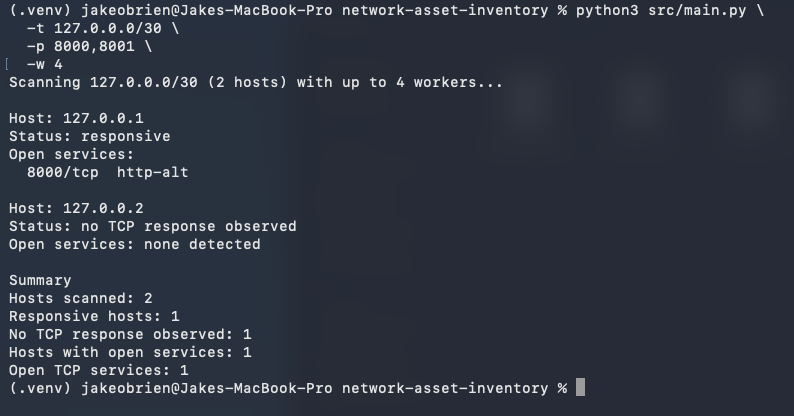
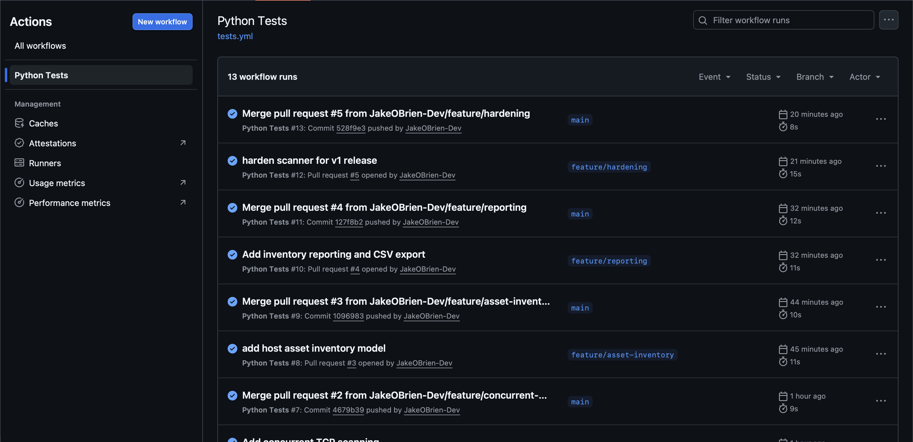

# Network Asset Inventory

## Overview

This is a Python-based cyber-security project designed to discover devices and identify exposed network services on authorised networks.

The goal of this project is to improve my understanding of networking, TCP connections, Python socket programming, network reconnaissance, asset discovery and secure software development.

Rather than relying entirely on existing tools like Nmap, this project builds core scanning functionality from the ground up so that I can understand how network discovery works at a lower level.

## Goals

The main goals of this project are to:

- Learn how TCP connections work.
- Understand how ports and network services are exposed.
- Practise Python networking and socket programming.
- Discover hosts and services on authorised networks.
- Produce structured network asset inventories.
- Develop a secure and maintainable command-line tool.
- Practise Git, GitHub, documentation and software testing.

## How It Works

The tool takes an IPv4 host or small CIDR subnet as input, validates the target and requested ports, and performs TCP connection checks using Python sockets.

The basic flow is:

Command-line input
        ↓
Input validation
        ↓
Target/subnet expansion
        ↓
Bounded concurrent TCP scanning
        ↓
Structured port results
        ↓
Host asset inventory
        ↓
Terminal / JSON / CSV reporting

Raw TCP results are kept alongside the higher-level asset inventory so that detailed scan information is not lost when generating summaries.

## Usage

### Activate the virtual environment

source .venv/bin/activate

### Scan the default TCP ports

python3 src/main.py --target 127.0.0.1

### Scan specific TCP ports

python3 src/main.py --target 127.0.0.1 --ports 22,80,443

### Short argument forms are also supported

python3 src/main.py -t 127.0.0.1 -p 22,80,443

### Display command-line help

python3 src/main.py --help

### Scan a TCP port range

python3 src/main.py --target 127.0.0.1 --range 20-100

Or:

python3 src/main.py -t 127.0.0.1 -r 20-100

### Concurrent scanning

The scanner uses a bounded thread pool to perform multiple TCP connection attempts concurrently.

The default worker count is 20:

python3 src/main.py --target 127.0.0.1 --range 1-100

A custom worker count can be selected with `-w` or `--workers`:

python3 src/main.py --target 127.0.0.1 --range 1-100 --workers 10

Worker counts are limited to between 1 and 100.

Multi-host scans use one globally bounded worker pool, meaning the configured worker count represents the maximum number of concurrent connection attempts across the entire scan.

### Scan a small IPv4 subnet using CIDR notation

python3 src/main.py --target 127.0.0.0/30 --ports 8000,8001

The scanner expands supported IPv4 CIDR networks into individual usable host addresses and scans each host separately.

Subnet scanning is currently limited to 16 usable hosts.

## Asset Inventory

The scanner converts raw TCP scan results into a higher-level asset inventory.

Each host record includes:

- Whether the host produced a TCP response
- Number of detected open TCP services
- Open service details
- Full underlying scan results

A host is considered responsive when at least one scanned TCP port returns either `OPEN` or `CLOSED`, because both states indicate that the target responded.

For example, a `CLOSED` port still means the remote host actively rejected the connection, which provides evidence that the host is reachable.

Example output:

Host: 127.0.0.1
Status: responsive
Open services:
  8000/tcp  http-alt

Host: 127.0.0.2
Status: no TCP response observed
Open services: none detected

Summary
Hosts scanned: 2
Responsive hosts: 1
No TCP response observed: 1
Hosts with open services: 1
Open TCP services: 1

## Service Names

The service names shown by the tool are based on conventional port assignments.

For example:

22/tcp    ssh
80/tcp    http
443/tcp   https
445/tcp   smb
3389/tcp  rdp

This does not guarantee that the application running on a port is actually that service.

For example, a service running on TCP port 443 is not automatically HTTPS. Proper service fingerprinting would require additional application-layer inspection.

## Reporting

The tool can export inventory reports in both JSON and CSV formats.

Each report includes:

- Scan target
- UTC scan timestamp
- Number of hosts scanned
- Number of responsive hosts
- Number of hosts with no observed TCP response
- Number of hosts exposing open services
- Total number of detected open TCP services
- Per-host asset information
- Open service details

### JSON export

python3 src/main.py \
  --target 127.0.0.0/30 \
  --ports 8000,8001 \
  --json output/inventory.json

### CSV export

python3 src/main.py \
  --target 127.0.0.0/30 \
  --ports 8000,8001 \
  --csv output/inventory.csv

### Both formats can be generated in the same scan

python3 src/main.py \
  --target 127.0.0.0/30 \
  --ports 8000,8001 \
  --json output/inventory.json \
  --csv output/inventory.csv

Generated reports under `output/` are excluded from Git to reduce the risk of accidentally publishing sensitive infrastructure information.

Sanitised example reports are kept separately in `sample_output/` for portfolio documentation.

## Testing

This project uses Python's built-in `unittest` framework.

Run the full test suite from the project root:

python3 -m unittest discover -s tests -v

The current test suite contains **42 automated tests** covering:

- Valid IPv4 addresses
- Invalid IPv4 addresses
- IPv6 rejection
- IPv4 subnet validation
- CIDR network normalisation
- Host expansion from IPv4 subnets
- `/31` subnet handling
- Subnet-size limits
- Valid port lists
- Non-numeric ports
- Out-of-range ports
- Duplicate port handling
- Empty port entries
- Port-range validation
- Maximum scan-size limits
- Worker-count validation
- Known service mappings
- Unknown service handling
- Socket error regression handling
- Structured scan-result generation
- Concurrent port scanning
- Deterministic result ordering
- Globally bounded multi-host concurrency
- Responsive and unresponsive host classification
- Open-service extraction
- Host inventory construction
- Inventory summary calculation
- UTC timestamp generation
- Timestamped report construction
- JSON report serialisation
- CSV report generation
- Hosts without open services remaining visible in exported inventories
- Graceful keyboard interruption
- Report-write error handling

## Continuous Integration

GitHub Actions automatically runs the test suite when code is pushed to `main` or when a pull request targets `main`.

This means changes are tested in a clean Ubuntu environment before they are merged.

The project was developed on macOS, so running the tests through GitHub Actions also helps catch platform-specific issues.

## Security

Real scan results may contain sensitive data such as private IP addresses, hostnames and exposed services, so I do not commit real-world scan results into this repository.

Instead, sanitised or synthetic examples are used for documentation and portfolio evidence.

Files under `output/` are ignored by Git by default.

## Safety and Reliability

The scanner includes several safeguards intended to keep operation predictable and controlled:

- IPv4 subnet scanning is limited to 16 usable hosts.
- Individual scans are limited to 4,096 TCP ports.
- Concurrent connection attempts use a globally bounded worker pool.
- Worker counts are limited to 1–100.
- Duplicate ports are automatically removed.
- Invalid and malformed input is rejected before scanning begins.
- Large subnets are rejected without first creating huge lists of addresses.
- `Ctrl+C` terminates a scan cleanly.
- Report-writing failures return a non-zero exit status.
- Raw scan output is excluded from Git by default.

These limits are intentional. The project is designed as an educational asset-inventory tool rather than a replacement for mature scanners such as Nmap.

## Ethical Use

This tool is intended only for systems and networks that I own or have explicit permission to assess.

Network scanning can trigger security monitoring, violate acceptable-use policies or cause unwanted load when performed without permission.

All examples committed to this repository use loopback, documentation or synthetic data.

## Project Structure

network-asset-inventory/
├── .github/
│   └── workflows/
│       └── tests.yml
├── docs/
├── sample_output/
├── screenshots/
├── src/
│   └── main.py
├── tests/
│   └── test_main.py
├── .gitignore
└── README.md

## Screenshots

### Asset inventory scan

### Automated testing with GitHub Actions

## Skills Demonstrated

Through this project I have practised:

- Python
- TCP/IP networking
- IPv4 addressing and CIDR
- Socket programming
- Network reconnaissance
- Asset discovery
- Concurrent programming
- Command-line application design
- Input validation
- JSON and CSV reporting
- Unit testing
- Mocking
- Regression testing
- Git and GitHub
- Feature branches 
- Pull requests
- GitHub Actions and CI
- Secure handling of network scan data
- Technical documentation

## Current Limitations

Version 1.0 intentionally keeps the scope controlled.

Current limitations include:

- IPv4 only
- TCP only
- Maximum 16-host subnet scans
- Maximum 4,096 ports per scan
- Conventional service-name mappings rather than active service fingerprinting
- No operating-system fingerprinting
- No UDP scanning
- No persistent asset database

These could all be expanded in future versions, but they are outside the scope of the initial portfolio release.

## Possible Future Improvements

Possible future improvements include:

- IPv6 support
- UDP scanning
- Configurable connection timeouts
- Active service fingerprinting
- Hostname resolution
- Persistent asset storage
- Comparing inventories between scans
- Additional reporting formats
- Larger authorised network ranges
- More detailed service information

I have deliberately kept these outside version 1.0 so that the project has a clear, achievable scope instead of continually adding features.

## Project Status

**Version 1.0.0.**

Version 1.0.0 represents the first completed portfolio release of the project.

The project currently includes:

- IPv4 target validation
- Individual host scanning
- Small IPv4 subnet scanning using CIDR notation
- TCP connection scanning
- Default port scanning
- User-selectable TCP ports
- TCP port-range scanning
- Differentiated TCP connection states
- Conventional service-name mapping
- Cross-platform socket error handling
- Concurrent TCP scanning
- Globally bounded multi-host concurrency
- Configurable worker count
- Deterministic result ordering
- Host-level asset inventory records
- Responsive-host identification
- Open-service summaries
- Detailed raw scan results
- UTC timestamped inventory reports
- JSON inventory export
- CSV inventory export
- Summary statistics
- Scan-size safeguards
- Duplicate port handling
- `/31` subnet handling
- Graceful keyboard interruption
- Report-write error handling
- 42 automated unit tests
- GitHub Actions continuous integration
